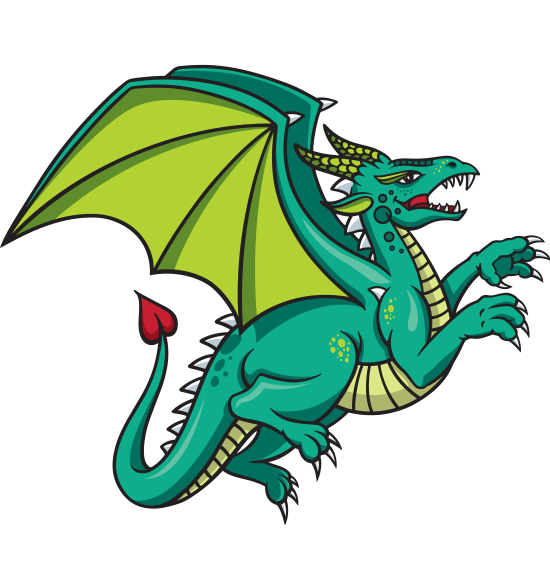
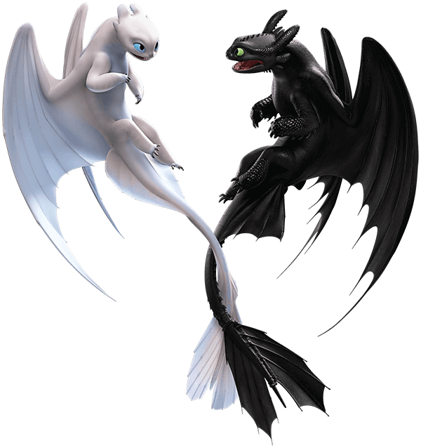

Github: https://github.com/sayana00111/DragonPhylogeny.git

I used images below, and characterized their features in binary way:

YanaA Dragon Image: cited from https://www.feedyourdragon.com/about.html 


YanaB Dragon Image: cited from https://studycli.org/chinese-culture/chinese-dragons/


YanaC Dragon Image: cited from https://www.kindpng.com/imgv/iRwRobi_train-your-dragon-3-light-fury-and-toothless/ and characters in How to Train Your Dragon produced by DreamWorks Pictures


Input the weightings first:
```{r}
wdata <- read.csv("input/Weights.csv")
Wei<-paste0(wdata$Weight,collapse="")
Wei<-strsplit(Wei,split="")[[1]]
wnum<-rep(NA,length(Wei))
for(i in 1:length(wnum)){
  if(Wei[i] %in% LETTERS){
    wnum[i]<-which(LETTERS==Wei[i])+9
  } else {
    wnum[i]<-Wei[i]
  }
}
wnum<-as.numeric(wnum)
```


Then import the data to create the matrix:
```{r}
library(ape)
dragon<-read.nexus.data("input/DragonMatrix.nex")
names(dragon)
```

```{r}
weidragon<-dragon
for (i in 1:length(dragon)){
  weirep<-dragon[[i]]==1
  weidragon[[i]][weirep]<-wnum[weirep]
  weirep<-NA
}
wddf<-data.frame(matrix(unlist(weidragon),ncol=78,byrow=T))
row.names(wddf)<-names(weidragon)
wddist<-dist(wddf,method='euclidean')
wdmat<-as.matrix(wddist)
```

Visualize it:
```{r}
library(reshape2)
drapd<-melt(wdmat)
head(drapd)
```
```{r}
library(ggplot2)
ggplot(data=drapd,aes(Var1,Var2,fill=value))+geom_tile()+scale_fill_gradientn(colours=c("blue","green","orange","red"))+theme(axis.text.x = element_text(angle = 90, hjust = 1, vjust = 0.5))
```

Finally, build the tree phylogeny
```{r}
library(ggtree)
tree<-fastme.bal(wddist)
ww<-gsub("[0-9\\.]+([^X]+)X*","\\1",tree$tip.label)
group<-split(tree$tip.label, ww)
Colour<-groupOTU(tree,group)
str(Colour)
ggtree(Colour,layout="circular",aes(colour=group))+geom_tiplab(size=2,aes(angle=angle))+
  geom_cladelabel(node=122,label="NewDragon",hjust=0.5,offset.text=6,fontsize=3,angle=-30,offset = 33,extend = 1)
```

According to the phylogeny tree of dragon we got, it is surprising that the new dragon species that I added derived new clade from the original known species. Although I tried to pick dragon images with dynamic features, they still have got relatively closer positions and a common ancestor. I think the reason could be non-unity-based standards on characterizing the features, since those dragons are not actually presented except legends. Those images cannot reflect partial variables, such as the weight. And if there are examples（pictures) corresponding to each trait, then it might allow researchers to describe dragons more specifically. 

